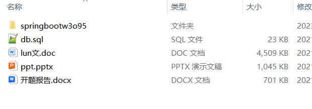

# springboot_house_psychology_shop_baby_book
📦 **SpringBoot多功能项目仓库** 🎯

本仓库汇集了五个基于 **Spring Boot** 开发的高实用性项目，涵盖房产销售、心理辅导、电商购物、母婴商城、读书笔记共享等多个领域，适用于学习、开发实践和功能拓展！🚀

🏡 **房产销售系统** —— 提供房源管理、在线咨询、购房预约、订单处理等功能，助力房地产数字化营销 💰🏠

🧠 **高校心理教育辅导系统** —— 实现心理测评、在线咨询、预约辅导、心理健康档案管理，帮助高校提升心理健康教育水平 🎓💡

🛍️ **免税商品购物商城系统** —— 集成商品管理、优惠促销、订单支付、物流跟踪，优化免税购物体验 ✈️🎁

👶 **母婴商城系统** —— 结合商品分类、母婴社区、育儿知识分享，实现一站式母婴电商服务 🍼💖

📖 **学生读书笔记共享系统** —— 支持笔记发布、阅读交流、个性化推荐，促进学生之间的知识分享与阅读兴趣培养 ✏️📚

所有项目均基于 **Spring Boot** 构建，结合 **MySQL、Redis、Vue.js** 等技术，具备良好的扩展性和实用性。欢迎 **Star & Fork**，一起交流学习！🚀

项目部署说明✨：

推荐使用：谷歌浏览器

后台地址😎
http://localhost:8080/springboot/admin/dist/index.html

管理员  abo 密码 abo

前台地址😎

http://localhost:8080/springboot/front/index.html

在src\main\resources\application.yml中编辑数据库配置🎉										
url: jdbc:mysql://127.0.0.1:3306/springboot?useUnicode=true&characterEncoding=utf-8&useJDBCCompliantTimezoneShift=true&useLegacyDatetimeCode=false&serverTimezone=UTC
username: root
password: 123456

文档预览👀

其他项目合集✨

